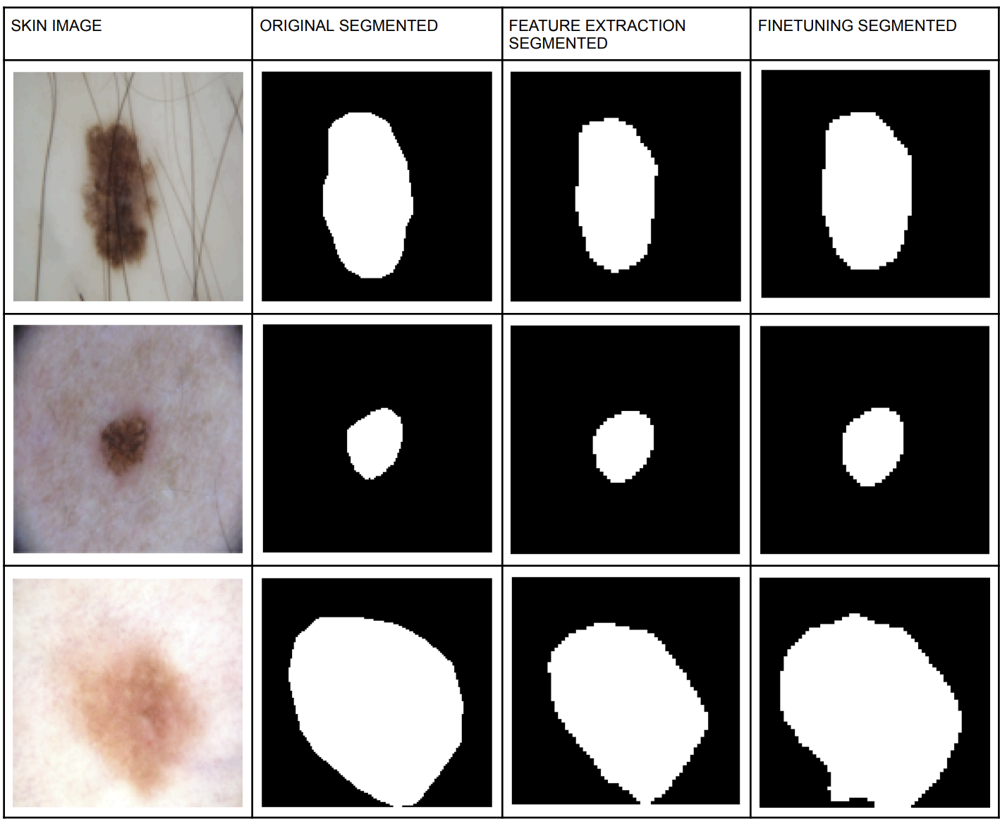
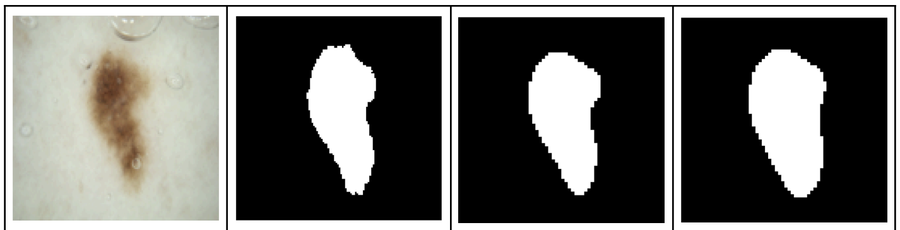

# Skin Lesion Segmentation using MobileNetV2 Transfer Learning

# Google Colab

🔗 https://drive.google.com/file/d/1qgn9cdX2yCa91X9YPMQjsN8G_m5O21A8/view?usp=drive_link

---

## Introduction

This project performs skin lesion segmentation on the ISIC 2016 Skin Lesion Dataset using Transfer Learning.

A MobileNetV2 model pretrained on ImageNet is used as the encoder, while a custom U-Net style decoder is designed for segmentation.

Two transfer learning strategies are compared:

- Feature Extraction
- Fine Tuning

---

# Results

## Segmentation Comparison




---

## Quantitative Results

| Method | IOU Score | Dice Score |
|----------|----------|----------|
| Feature Extraction | 0.83 | 0.90 |
| Fine Tuning | 0.83 | 0.91 |

---

# Handwritten Report

📄 https://drive.google.com/file/d/1CpZ7BXkFHlc7gKyGUCEGpMp-8GOijMYZ/view?usp=drive_link

---

# Model Weights

## Feature Extraction

📦 https://drive.google.com/file/d/1Sxy5sVKdQIGwv88RmfxDF8Zl0WCIDKNC/view?usp=drive_link

## Fine Tuning

📦 https://drive.google.com/file/d/11uhWtx8cj6LY75ql0c-w2KGZ5GlW_lKV/view?usp=drive_link

---

# Test Predictions

📁 https://drive.google.com/drive/folders/1dV2tUKhs8jBRe-Bs2UhuGs859JpiotCq?usp=drive_link [Feature Extraction]

📁 https://drive.google.com/drive/folders/1GH4nEfvrHziPd6-JbFadlfl0ohWxMuJy?usp=drive_link [Fine Tuning]


---

# Theory

## Problem Statement

Skin lesion segmentation is an important preprocessing step for computer-aided skin cancer diagnosis.

The objective is to accurately separate lesion pixels from healthy skin pixels.

---

## Dataset

### ISIC 2016

- Dermoscopic Skin Lesion Images
- Binary Segmentation Masks

### Preprocessing

- Resize to 128 × 128
- Image normalization
- Binary mask conversion

---

## Architecture

### Encoder

MobileNetV2 pretrained on ImageNet.

The encoder is divided into five feature extraction stages:

```text
[B,3,128,128]
      ↓
[B,16,64,64]
      ↓
[B,24,32,32]
      ↓
[B,32,16,16]
      ↓
[B,96,8,8]
      ↓
[B,1280,4,4]
```

### Decoder

Custom U-Net style decoder using:

- Transposed Convolutions
- Skip Connections
- Upsampling Blocks

Final output:

```text
[B,1,128,128]
```

A sigmoid activation produces pixel-wise probabilities.

---

## Feature Extraction

The pretrained MobileNetV2 encoder is frozen.

Only the decoder parameters are trained.

Advantages:

- Faster training
- Fewer trainable parameters
- Reduced overfitting

---

## Fine Tuning

The final encoder block is unfrozen and trained together with the decoder.

Advantages:

- Better domain adaptation
- Improved segmentation accuracy

---

## Loss Function

### Dice Loss

Dice coefficient:

Dice = 2(A∩B)/(A+B)

Dice Loss:

Loss = 1 − Dice

Dice Loss is preferred because segmentation datasets are highly imbalanced.

---

## Evaluation Metrics

### IOU

IOU = (A∩B)/(A∪B)

### Dice Score

Dice = 2(A∩B)/(A+B)

Higher values indicate better overlap between predicted masks and ground truth masks.

---

# Conclusion

Transfer learning with MobileNetV2 achieves strong segmentation performance on the ISIC 2016 dataset.

Fine Tuning provides a slight improvement in Dice Score compared to Feature Extraction while maintaining the same IOU Score.

---

## Author

Pranav Deshpande
* IIT Jodhpur
* Deep Learning 
* Medical Imaging 
* Computer Vision
